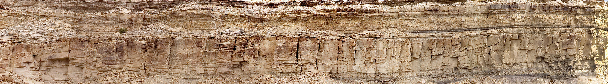

  

# Geology Photo Stitcher Tools

A collection of Python scripts for automating geological image processing, including HDRs, Panoramas, and Stratigraphic Core rendering.

### Prerequisites

Install Hugin (For Panoramas/HDR):

Many of the scripts require the Hugin Panorama Stitcher command-line tools.

&#x09;Windows: Download from hugin.sourceforge.io.

&#x09;Mac/Linux: Install via Homebrew (brew install hugin) or your package manager.

Install Python Libraries:

Bash

pip install -r requirements.txt

### How to Use

There are currently eight independent scripts that perform different tasks:

1. Batch Processing \& Presentation Scripts:

2\. Pano\_Batcher.py : Searches through a folder and finds sets of images to stitch into photomosaics.

3\. HDR\_Batcher.py : Finds sets of images to combine to make high-dynamic-range (HDR) or focus-stack photos.

4\. ImageSeq\_to\_Video.py : Combines images in a folder to make a video (Microsoft Moviemaker replacement).

5\. PhotoMosaicPan.py : Makes a video that pans along a photomosaic (better for sharing and presentation of observations).

6\. EarthTimelapse.py : User-friendly download of high-resolution LandSat timelapse images from Google EarthEngine.

7\. Core Processing Suite (GUI Tools):

&#x09;i. CoreSegmentStitcher.py : Interactive GUI tool for extracting vertical core segments from box photos and stitching them into continuous columns.

&#x09;ii. CoreSegmentExtractor.py : Interactive GUI tool for batch-extracting individual core segments into separate image files.

&#x09;iii. CoreSegment2Video.py : Converts stitched core columns into a continuous vertical fly-through video.

### Execution Instructions:

For Scripts 1-6: Open the script in Jupyter, CoLab, or your preferred Python environment. Edit the Configuration Section at the top of the code segment, then run the script.

For Scripts 7 i, ii, iii (Core Suite): These are standalone graphical applications. Simply run them directly from your terminal or command prompt (e.g., python Core\_Stitcher.py). A window will pop up prompting you to select your folders and interact with the images.

### Notes on use

Pano \& HDR Batchers: These scripts might work on a folder with a mix of image files by selecting images for processing with similar time stamps. If this auto-selection fails (because there are other sets of photos with similar time stamps resulting from, for example, rapid sports shooting), put just the files to be processed in a separate folder.

Focus Stacking: The HDR\_Batcher.ipynb script will also do focus stacking; see comments in the code for details.

Image Sequences: The ImageSeq\_to\_Video.ipynb script expects the files to be ordered sequentially.

Panoramas: The PhotoMosaicPan.ipynb expects an image that is much longer than it is high.

Core Processing Suite: The Core\_Stitcher and Core\_Extractor rely on a "human-in-the-loop" workflow. You will use your mouse to define the bounding boxes for the core segments on the first image. The script will remember your layout for subsequent images, significantly speeding up the processing of photos taken from a static tripod.

Core Video Generation: The Core\_Video\_Generator.py is specifically engineered to bypass standard JPEG height limits (65,535 pixels). It reads your hard drive directly to render the video, ensuring it will not crash your system's RAM even when processing thousands of frames.

### More details on the use of each script are listed in their respective file headers.

